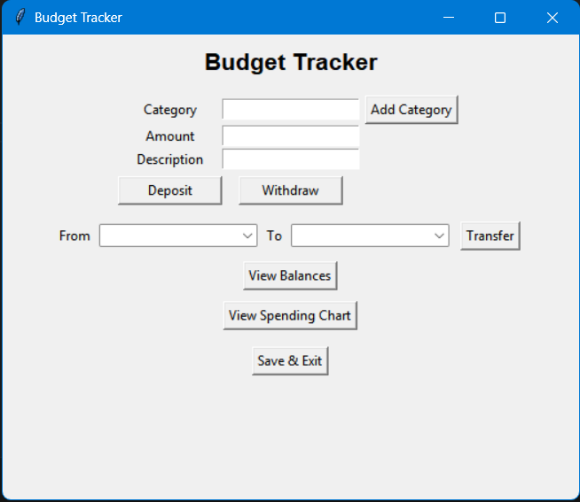
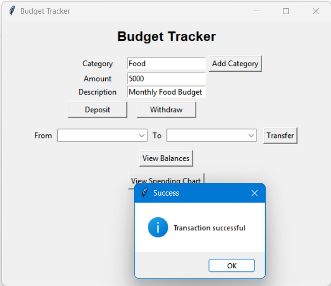
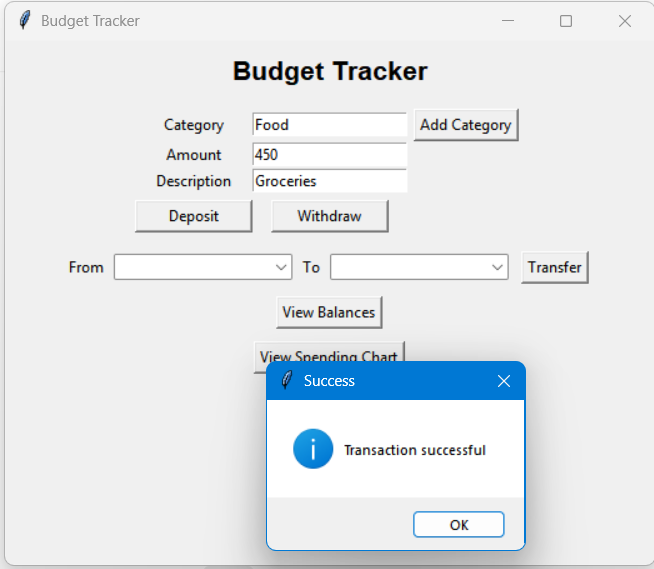

# Budget Tracker – Python

A command-line based personal budget management application built using Python and Object-Oriented Programming principles.

## Features
- Create multiple budget categories
- Deposit and withdraw funds
- Transfer money between categories
- Track category-wise expenses
- Generate a percentage-based spending chart
- Persistent data storage using JSON

## Tech Stack
- Python
- Object-Oriented Programming (OOP)
- JSON
- Command Line Interface (CLI)

## How to Run
1. Clone the repository or download the project files
2. Navigate to the project folder
3. Run the application:

```bash
python main.py

## Screenshots

### Main Application Interface


### Deposit Transaction


### Expense Withdrawal

